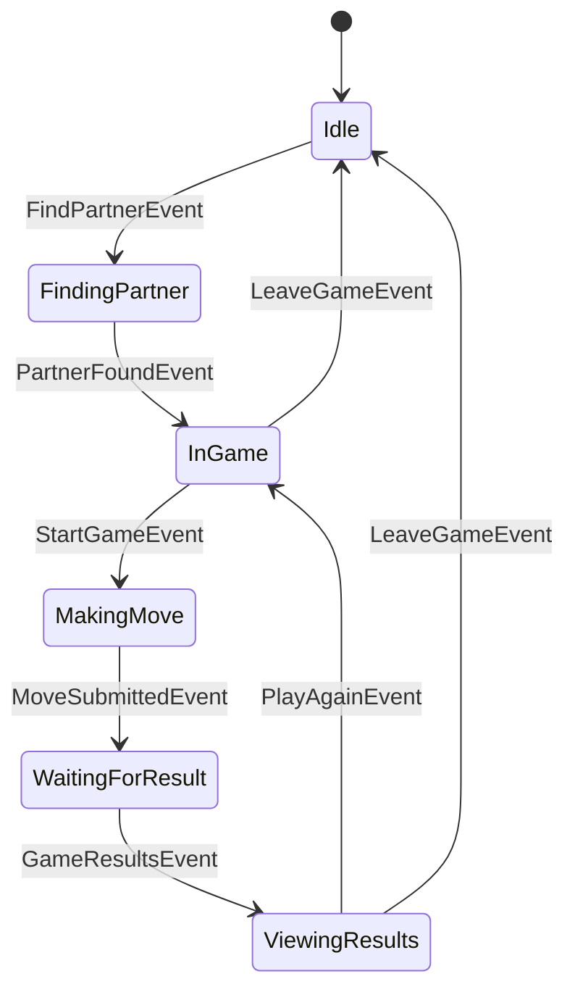
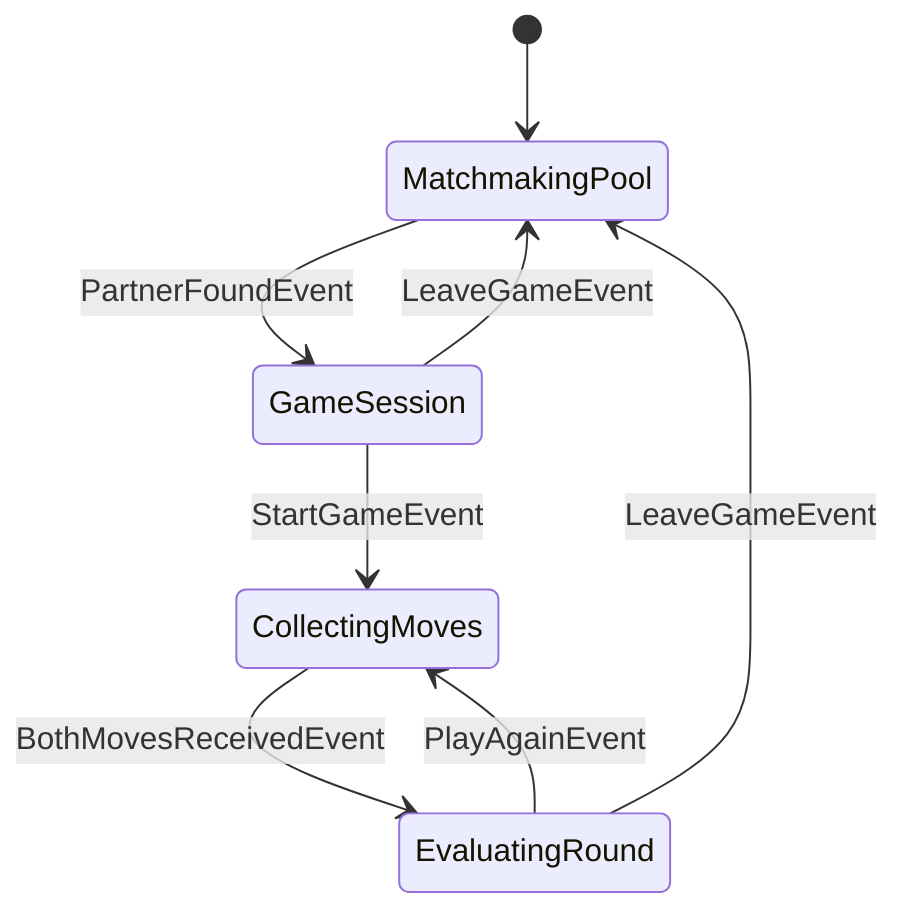

# scissors
Rock Paper Scissors Game

## Game State Machines

### Client State Machine



### Server State Machine



## WebSocket API Protocol

### Connection
Connect to: `ws://localhost:8080/ws`

### Message Format
All messages are JSON objects with this structure:
```json
{
  "type": "event_type",
  "data": { /* optional payload */ }
}
```

### Client to Server Events

#### Find Partner
```json
{
  "type": "find_partner"
}
```

#### Submit Move
```json
{
  "type": "move_submitted",
  "data": {
    "move": "rock" | "paper" | "scissors"
  }
}
```

#### Play Again
```json
{
  "type": "play_again"
}
```

#### Leave Game
```json
{
  "type": "leave_game"
}
```

### Server to Client Events

#### Partner Found
```json
{
  "type": "partner_found",
  "data": {
    "game_id": "game_1234567890"
  }
}
```

#### Start Game
```json
{
  "type": "start_game"
}
```

#### Game Results
```json
{
  "type": "game_results",
  "data": {
    "your_move": "rock" | "paper" | "scissors",
    "opponent_move": "rock" | "paper" | "scissors",
    "result": "win" | "lose" | "tie"
  }
}
```

### Game Flow Protocol

1. **Connect** to WebSocket endpoint
2. **Send** `find_partner` event to join matchmaking
3. **Receive** `partner_found` event when matched
4. **Receive** `start_game` event to begin a round
5. **Send** `move_submitted` with your move
6. **Receive** `game_results` with round outcome
7. **Send** `play_again` or `leave_game` to continue/exit


### Example Client Implementation (C#)

```csharp
using System.Net.WebSockets;
using System.Text;
using System.Text.Json;

var ws = new ClientWebSocket();
await ws.ConnectAsync(new Uri("ws://localhost:8080/ws"), CancellationToken.None);

// Send event
async Task SendEvent(string type, object data = null)
{
    var message = JsonSerializer.Serialize(new { type, data });
    var buffer = Encoding.UTF8.GetBytes(message);
    await ws.SendAsync(buffer, WebSocketMessageType.Text, true, CancellationToken.None);
}

// Receive and handle events
var buffer = new byte[1024];
while (ws.State == WebSocketState.Open)
{
    var result = await ws.ReceiveAsync(buffer, CancellationToken.None);
    var message = Encoding.UTF8.GetString(buffer, 0, result.Count);
    var eventData = JsonSerializer.Deserialize<JsonElement>(message);
    
    string eventType = eventData.GetProperty("type").GetString();
    
    switch (eventType)
    {
        case "partner_found":
            Console.WriteLine("Partner found!");
            break;
        case "start_game":
            Console.WriteLine("Round starting!");
            await SendEvent("move_submitted", new { move = "rock" });
            break;
        case "game_results":
            var data = eventData.GetProperty("data");
            Console.WriteLine($"You {data.GetProperty("result").GetString()}!");
            await SendEvent("play_again");
            break;
    }
}
```


### Example Client Implementation (TypeScript)

```typescript
const ws = new WebSocket('ws://localhost:8080/ws');

// Send event to server
function sendEvent(type: string, data?: any) {
  ws.send(JSON.stringify({ type, data }));
}

// Handle incoming events
ws.onmessage = (event) => {
  const { type, data } = JSON.parse(event.data);
  
  switch (type) {
    case 'partner_found':
      console.log('Partner found! Game ID:', data.game_id);
      break;
    case 'start_game':
      console.log('Round starting!');
      // Send your move
      sendEvent('move_submitted', { move: 'rock' });
      break;
    case 'game_results':
      console.log(`You ${data.result}! You: ${data.your_move}, Opponent: ${data.opponent_move}`);
      // Play again or leave
      sendEvent('play_again');
      break;
  }
};

// Start matchmaking
sendEvent('find_partner');
```


