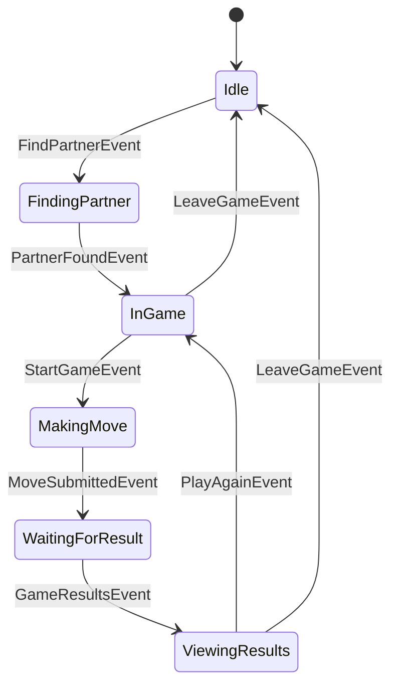
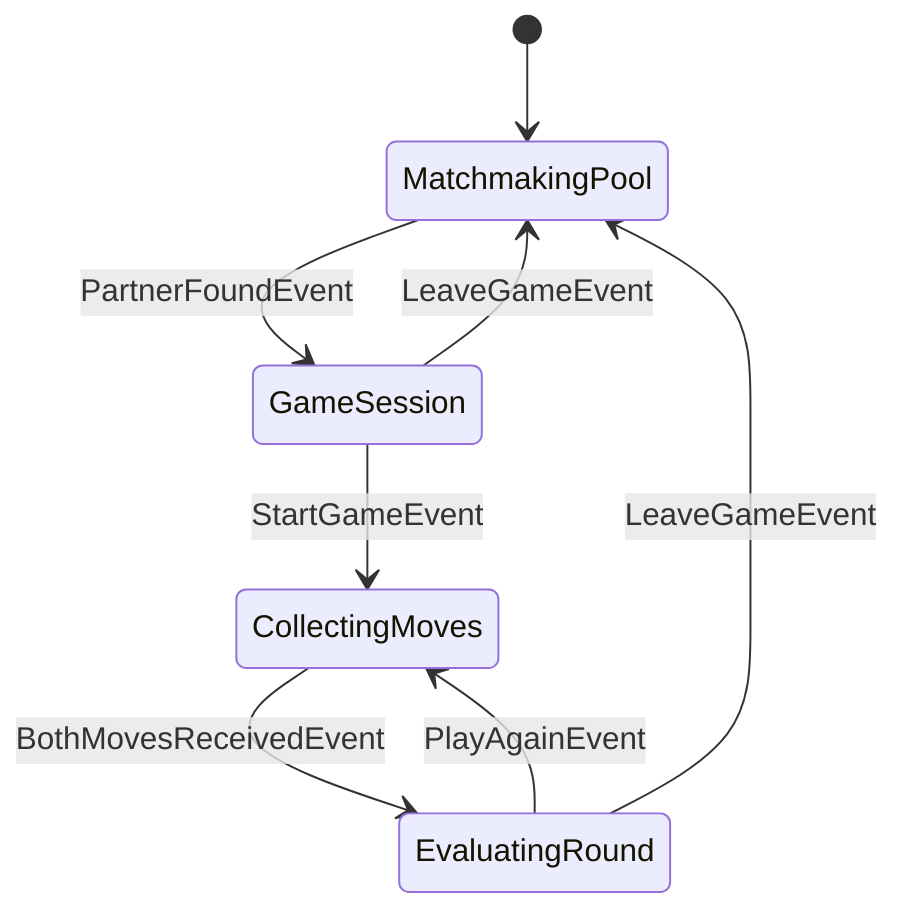

# scissors
Rock Paper Scissors Game

## Game State Machines

### Client State Machine

```mermaid
stateDiagram-v2
    [*] --> Idle
    Idle --> FindingPartner : FindPartnerEvent
    FindingPartner --> InGame : PartnerFoundEvent
    InGame --> MakingMove : StartGameEvent
    MakingMove --> WaitingForResult : MoveSubmittedEvent
    WaitingForResult --> ViewingResults : GameResultsEvent
    ViewingResults --> InGame : PlayAgainEvent
    ViewingResults --> Idle : LeaveGameEvent
    InGame --> Idle : LeaveGameEvent
```

### Server State Machine

```mermaid
stateDiagram-v2
    [*] --> MatchmakingPool
    MatchmakingPool --> GameSession : PartnerFoundEvent
    GameSession --> CollectingMoves : StartGameEvent
    CollectingMoves --> EvaluatingRound : BothMovesReceivedEvent
    EvaluatingRound --> CollectingMoves : PlayAgainEvent
    EvaluatingRound --> MatchmakingPool : LeaveGameEvent
    GameSession --> MatchmakingPool : LeaveGameEvent
```
